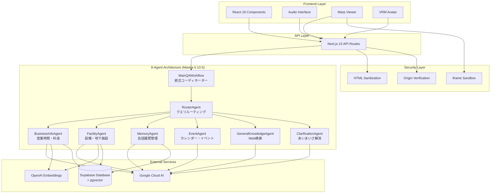

# Engineer Cafe Navigator ドキュメント

> 包括的なプロジェクトドキュメント集

## 📚 ドキュメント一覧

### 🏠 メインドキュメント
- **[README.md](../README.md)** - プロジェクト概要・セットアップガイド・基本的な使用方法

### 🛠️ 技術ドキュメント

#### 📖 API仕様
- **[API.md](API.md)** - REST API 完全仕様書
  - 音声処理API
  - スライド制御API
  - キャラクター制御API
  - 外部連携API
  - Q&A API
  - エラーハンドリング
  - 認証・セキュリティ

#### 🔒 セキュリティ
- **[SECURITY.md](SECURITY.md)** - セキュリティ対策・脅威分析
  - XSS対策実装
  - iframe サンドボックス化
  - postMessage Origin検証
  - データ保護・プライバシー
  - インシデント対応手順
  - セキュリティ監査

#### 🔧 開発ガイド
- **[DEVELOPMENT.md](DEVELOPMENT.md)** - 開発者向け技術仕様
  - 開発環境セットアップ
  - アーキテクチャ詳細
  - コンポーネント設計原則
  - 状態管理パターン
  - スタイリング規約
  - テスト戦略
  - デバッグ・監視

#### 🚀 デプロイメント
- **[DEPLOYMENT.md](DEPLOYMENT.md)** - 本番環境デプロイ手順
  - インフラストラクチャ構成
  - Vercel デプロイ
  - Supabase 設定
  - Google Cloud 設定
  - 監視・ログ設定
  - CI/CD パイプライン
  - トラブルシューティング

## 🎯 ドキュメント使用ガイド

### 新しい開発者向け

1. **[README.md](../README.md)** - プロジェクト概要を理解
2. **[DEVELOPMENT.md](DEVELOPMENT.md)** - 開発環境をセットアップ
3. **[API.md](API.md)** - API仕様を確認
4. **[SECURITY.md](SECURITY.md)** - セキュリティ要件を理解

### 本番デプロイ担当者向け

1. **[DEPLOYMENT.md](DEPLOYMENT.md)** - デプロイ手順を実行
2. **[SECURITY.md](SECURITY.md)** - セキュリティ設定を確認
3. **[API.md](API.md)** - エンドポイント動作を検証

### セキュリティ担当者向け

1. **[SECURITY.md](SECURITY.md)** - セキュリティ対策を確認
2. **[DEVELOPMENT.md](DEVELOPMENT.md)** - 開発プロセスを理解
3. **[DEPLOYMENT.md](DEPLOYMENT.md)** - 本番環境設定を監査

## 📋 実装状況サマリー

### ✅ 完了済み機能

| カテゴリ | 機能 | 実装状況 | ドキュメント |
|----------|------|----------|-------------|
| **音声処理** | 音声認識・合成 | ✅ 完了 | [API.md](API.md#音声処理-api) |
| **スライド制御** | Marpスライド表示・操作 | ✅ 完了 | [API.md](API.md#スライド-api) |
| **キャラクター** | VRM 3Dキャラクター | ✅ 完了 | [API.md](API.md#キャラクター制御-api) |
| **多言語対応** | 日本語・英語切り替え | ✅ 完了 | [README.md](../README.md#主要機能) |
| **背景制御** | 動的背景変更 | ✅ 完了 | [README.md](../README.md#背景画像の配置) |
| **セキュリティ** | XSS対策・Origin検証 | ✅ 完了 | [SECURITY.md](SECURITY.md#実装済みセキュリティ対策) |
| **8エージェント体制** | マルチエージェントアーキテクチャ | ✅ 完了 | [README.md](../README.md#8エージェント体制への完全移行) |
| **あいまいさ解消** | カフェ・会議室の明確化 | ✅ 完了 | [README.md](../README.md#あいまいさ解消機能) |
| **会話記憶** | 3分間の短期記憶 | ✅ 完了 | [memory-rag-integration.md](memory-rag-integration.md) |
| **Enhanced RAG** | エンティティ認識・優先度スコアリング | ✅ 完了 | [RAG-SYSTEM-COMPLETION-REPORT.md](RAG-SYSTEM-COMPLETION-REPORT.md) |

### 🔄 実装予定機能

| 機能 | 優先度 | 予定時期 | 関連ドキュメント |
|------|--------|----------|-----------------|
| レート制限 | 高 | Q1 2024 | [SECURITY.md](SECURITY.md#api-セキュリティ) |
| 外部システム連携 | 中 | Q2 2024 | [API.md](API.md#外部連携-api) |
| 高度なAI対話 | 中 | Q2 2024 | [README.md](../README.md#ロードマップ) |
| モバイル対応 | 低 | Q3 2024 | [README.md](../README.md#ロードマップ) |

## 🏗️ アーキテクチャ概要



## 🔐 セキュリティハイライト

### 実装済み対策

- **XSS防止**: HTMLサニタイゼーション + CSP
- **iframe 保護**: サンドボックス化 + Origin検証
- **通信暗号化**: HTTPS + セキュリティヘッダー
- **入力検証**: Zod スキーマバリデーション
- **状態管理**: UI状態同期によるプライバシー保護

詳細: **[SECURITY.md](SECURITY.md)**

## 📊 パフォーマンス目標

| メトリクス | 目標値 | 現在値 | 測定方法 |
|-----------|--------|--------|----------|
| 初期ロード時間 | < 2秒 | ~1.5秒 | Lighthouse |
| API応答時間 | < 800ms | ~600ms | 内部監視 |
| 音声認識開始 | < 200ms | ~150ms | Performance API |
| スライド切り替え | < 100ms | ~80ms | デバッグパネル |

## 🛠️ 開発ツール・設定

### 必要なツール
- **Node.js**: 18.0.0+
- **pnpm**: 8.0.0+
- **Git**: 最新版
- **VSCode**: 推奨エディタ

### 推奨拡張機能
- Tailwind CSS IntelliSense
- TypeScript Next.js
- Prettier
- ESLint

詳細: **[DEVELOPMENT.md](DEVELOPMENT.md#開発環境セットアップ)**

## 🚀 クイックスタート

```bash
# 1. リポジトリクローン
git clone https://github.com/your-org/engineer-cafe-navigator.git
cd engineer-cafe-navigator

# 2. 依存関係インストール
pnpm install

# 3. 環境変数設定
cp .env.example .env.local
# .env.localを編集

# 4. 開発サーバー起動
pnpm run dev
```

詳細手順: **[README.md](../README.md#クイックスタート)**

## 📞 サポート・コントリビューション

### 技術サポート
- **Issues**: [GitHub Issues](https://github.com/your-org/engineer-cafe-navigator/issues)
- **Discussions**: [GitHub Discussions](https://github.com/your-org/engineer-cafe-navigator/discussions)
- **Email**: tech-support@engineer-cafe.jp

### コントリビューション
1. フォーク → ブランチ作成 → 変更 → プルリクエスト
2. **[DEVELOPMENT.md](DEVELOPMENT.md#コード品質・規約)** のコーディング規約に従う
3. テスト追加・セキュリティ考慮必須

### ドキュメント改善
ドキュメントの改善提案や誤字脱字の報告も歓迎します！

## 📝 更新履歴

### v1.3.0 (2025-07-03)
- ✅ 8エージェント体制への完全移行
- ✅ ClarificationAgent実装（あいまいさ解消機能）
- ✅ メモリベースのフォローアップ対応
- ✅ レガシーコード削除（EnhancedQAAgent 2,342行）
- ✅ ドキュメント全面更新

### v1.2.0 (2024-01-30)
- ✅ セキュリティ強化（XSS対策、Origin検証）
- ✅ 背景制御機能追加
- ✅ UI状態同期改善
- ✅ ドキュメント全面更新

### v1.1.0 (2024-01-25)
- ✅ Marpスライドビューア改善
- ✅ キャラクター表情制御
- ✅ 多言語対応強化

### v1.0.0 (2024-01-20)
- ✅ 初期リリース
- ✅ 基本機能実装完了

---

<div align="center">

**📚 Comprehensive Documentation - Engineer Cafe Navigator**

[🏠 メインページ](../README.md) • [🔧 開発ガイド](DEVELOPMENT.md) • [🚀 デプロイガイド](DEPLOYMENT.md) • [🔒 セキュリティ](SECURITY.md)

---

**Built with ❤️ by Engineer Cafe Team**

</div>