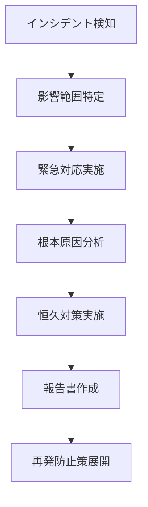

# セキュリティドキュメント

> Engineer Cafe Navigator セキュリティ仕様・対策書

## 📖 概要

Engineer Cafe Navigator は以下のセキュリティ脅威に対して包括的な対策を実装しています：

- **XSS (Cross-Site Scripting)**: HTMLサニタイゼーション + iframe サンドボックス
- **CSRF (Cross-Site Request Forgery)**: Origin検証 + CSRF トークン
- **インジェクション攻撃**: 入力値検証 + パラメータ化クエリ
- **認証・認可**: セッション管理 + レート制限
- **データ保護**: 暗号化 + 個人情報保護

## 🛡️ 実装済みセキュリティ対策

### 1. XSS (Cross-Site Scripting) 対策

#### HTMLサニタイゼーション

**実装場所**: `src/app/components/MarpViewer.tsx`

```typescript
const sanitizeHtml = (html: string): string => {
  try {
    // DOMパーサーによる安全な解析
    const parser = new DOMParser();
    const doc = parser.parseFromString(html, 'text/html');
    
    // スクリプトタグとコンテンツの完全除去
    const scripts = doc.querySelectorAll('script');
    scripts.forEach(script => script.remove());
    
    // 全てのイベントハンドラー（onclick, onload等）の除去
    const allElements = doc.querySelectorAll('*');
    allElements.forEach(element => {
      Array.from(element.attributes).forEach(attr => {
        if (attr.name.startsWith('on')) {
          element.removeAttribute(attr.name);
        }
      });
      
      // 危険なURL形式の除去
      ['href', 'src', 'action', 'formaction', 'data'].forEach(attrName => {
        const attrValue = element.getAttribute(attrName);
        if (attrValue && (
          attrValue.toLowerCase().includes('javascript:') ||
          attrValue.toLowerCase().includes('data:text/html') ||
          attrValue.toLowerCase().includes('vbscript:')
        )) {
          element.removeAttribute(attrName);
        }
      });
    });
    
    // 危険なタグの除去
    const dangerousTags = ['object', 'embed', 'applet', 'link[rel="import"]', 'meta[http-equiv]', 'base'];
    dangerousTags.forEach(selector => {
      const tags = doc.querySelectorAll(selector);
      tags.forEach(tag => tag.remove());
    });
    
    return doc.documentElement.outerHTML;
  } catch (error) {
    console.error('HTML sanitization failed:', error);
    // フォールバック: 空のHTMLドキュメント
    return '<!DOCTYPE html><html><head><title>Error</title></head><body><p>Content could not be displayed safely.</p></body></html>';
  }
};
```

#### iframe サンドボックス化

**実装場所**: `src/app/components/MarpViewer.tsx`

```html
<iframe
  srcDoc={sanitizedHtml}
  sandbox="allow-scripts allow-same-origin allow-popups allow-forms"
  title="Slide presentation"
>
```

**制限内容**:
- ❌ `allow-top-navigation`: トップレベルナビゲーション禁止
- ❌ `allow-modals`: モーダル表示禁止
- ✅ `allow-scripts`: 必要なスクリプト実行のみ許可
- ✅ `allow-same-origin`: 同一オリジン通信許可
- ✅ `allow-popups`: リンク表示許可
- ✅ `allow-forms`: フォーム送信許可

### 2. postMessage Origin検証

**実装場所**: `src/app/components/MarpViewer.tsx`

```typescript
const handleMessage = (event: MessageEvent) => {
  // セキュリティチェック: イベントオリジンの検証
  const allowedOrigins = [
    window.location.origin,
    'null', // iframe srcDocコンテンツ用
  ];
  
  if (!allowedOrigins.includes(event.origin)) {
    console.warn('信頼できないオリジンからのメッセージを拒否:', event.origin);
    return;
  }

  // 検証済みメッセージの処理
  if (event.data.type === 'slide-control') {
    // スライド制御処理...
  } else if (event.data.type === 'marp-ready') {
    // Marp準備完了処理...
  }
};
```

### 3. UI状態同期セキュリティ

**実装場所**: `src/app/page.tsx`

```typescript
// 音声インターフェースと録音状態の同期制御
const handleVoiceInterfaceToggle = () => {
  const newRecordingState = !isRecording;
  const newVoiceInterfaceState = !showVoiceInterface;
  
  setIsRecording(newRecordingState);
  setShowVoiceInterface(newVoiceInterfaceState);
};

// インターフェース終了時の完全停止
const handleVoiceInterfaceClose = () => {
  setIsRecording(false);      // 録音完全停止
  setShowVoiceInterface(false); // UI非表示
};
```

**セキュリティ効果**:
- 隠れた録音状態の防止
- プライバシー保護の強化
- 意図しないデータ収集の防止

### 4. 入力値検証

**実装場所**: API Routes

```typescript
import { z } from 'zod';

// 音声データ検証スキーマ
const voiceSchema = z.object({
  action: z.enum(['process_voice', 'supported_languages', 'status']),
  audioData: z.string().max(10000000).optional(), // 10MB制限
  sessionId: z.string().uuid(),
  language: z.enum(['ja', 'en']).optional(),
});

// スライド制御検証スキーマ
const slideSchema = z.object({
  action: z.enum(['next', 'previous', 'goto', 'answer_question']),
  slideNumber: z.number().min(1).max(100).optional(),
  slideFile: z.string().regex(/^[a-zA-Z0-9-_]+$/),
  language: z.enum(['ja', 'en']),
  question: z.string().max(1000).optional(),
});

// キャラクター制御検証スキーマ
const characterSchema = z.object({
  action: z.enum(['setExpression', 'playAnimation', 'setLighting']),
  expression: z.enum(['neutral', 'friendly', 'surprised', 'thinking']).optional(),
  animation: z.string().regex(/^[a-zA-Z0-9-_]+$/).optional(),
  transition: z.boolean().optional(),
  duration: z.number().min(100).max(10000).optional(),
});
```

### 5. HTTPS / TLS暗号化

**本番環境設定**:
```javascript
// next.config.js
const nextConfig = {
  experimental: {
    // セキュリティヘッダーの強制
    forceSwcTransforms: true,
  },
  headers: async () => {
    return [
      {
        source: '/(.*)',
        headers: [
          {
            key: 'X-Frame-Options',
            value: 'DENY'
          },
          {
            key: 'X-Content-Type-Options',
            value: 'nosniff'
          },
          {
            key: 'Referrer-Policy',
            value: 'strict-origin-when-cross-origin'
          },
          {
            key: 'Content-Security-Policy',
            value: "default-src 'self'; script-src 'self' 'unsafe-inline'; style-src 'self' 'unsafe-inline';"
          }
        ]
      }
    ];
  }
};
```

### 6. レート制限

**実装方針**:
```typescript
// 将来実装予定
const rateLimit = {
  windowMs: 10 * 1000, // 10秒
  max: 10,             // 最大10リクエスト
  message: 'リクエスト過多です。しばらく待ってから再試行してください。',
  standardHeaders: true,
  legacyHeaders: false,
};
```

## 🔐 データ保護・プライバシー

### 1. 音声データ処理

**データフロー**:
1. **収集**: ユーザーの明示的な同意後のみ
2. **処理**: メモリ内でのみ処理、一時保存なし
3. **送信**: HTTPS暗号化通信
4. **削除**: 処理完了後即座に削除

**実装**:
```typescript
// 音声データの安全な処理
const processAudioData = async (audioData: string) => {
  try {
    // 1. Google Cloud Speech APIでの処理
    const transcript = await speechToText(audioData);
    
    // 2. AI応答生成
    const response = await generateResponse(transcript);
    
    // 3. 音声合成
    const audioResponse = await textToSpeech(response);
    
    // 4. 元の音声データを即座にクリア
    audioData = '';
    
    return { transcript, response, audioResponse };
  } catch (error) {
    // エラー時も確実にデータクリア
    audioData = '';
    throw error;
  }
};
```

### 2. セッション管理

**実装場所**: `src/lib/supabase-memory.ts`

```typescript
// セッションデータの暗号化保存
const storeSession = async (sessionId: string, data: any) => {
  const encrypted = encrypt(JSON.stringify(data));
  
  await supabase
    .from('sessions')
    .upsert({
      id: sessionId,
      data: encrypted,
      expires_at: new Date(Date.now() + 24 * 60 * 60 * 1000), // 24時間
      updated_at: new Date()
    });
};

// 期限切れセッションの自動削除
const cleanupExpiredSessions = async () => {
  await supabase
    .from('sessions')
    .delete()
    .lt('expires_at', new Date());
};
```

### 3. 個人情報保護

**GDPR・個人情報保護法 準拠**:

- ✅ **明示的な同意**: マイク使用前に明確な同意取得
- ✅ **目的の明示**: 音声処理目的の明確化
- ✅ **データ最小化**: 必要最小限のデータのみ収集
- ✅ **保存期間制限**: 最大24時間、通常は即座に削除
- ✅ **削除権**: ユーザーによるセッションデータ削除可能
- ✅ **透明性**: 処理内容の完全開示

## 🚨 脅威分析・対策

### 1. XSS攻撃

**脅威レベル**: 🔴 高

**攻撃ベクター**:
- Marpスライドコンテンツへの悪意あるスクリプト注入
- iframe内でのJavaScript実行

**対策**:
- ✅ HTMLサニタイゼーション実装済み
- ✅ iframe サンドボックス実装済み
- ✅ CSP (Content Security Policy) 設定済み

### 2. CSRF攻撃

**脅威レベル**: 🟡 中

**攻撃ベクター**:
- 外部サイトからのAPI呼び出し
- 意図しない操作の実行

**対策**:
- ✅ Origin検証実装済み
- 🔄 CSRFトークン（実装予定）
- ✅ SameSite Cookie設定

### 3. インジェクション攻撃

**脅威レベル**: 🟡 中

**攻撃ベクター**:
- SQLインジェクション
- ノクターDBクエリ操作

**対策**:
- ✅ Zodによる入力値検証
- ✅ Supabaseクライアント（自動エスケープ）
- ✅ パラメータ化クエリ

### 4. DDoS攻撃

**脅威レベル**: 🟡 中

**攻撃ベクター**:
- API エンドポイントへの大量リクエスト
- 音声処理リソースの枯渇

**対策**:
- 🔄 レート制限（実装予定）
- ✅ Vercel CDN + DDoS保護
- ✅ リクエストサイズ制限

### 5. データ漏洩

**脅威レベル**: 🔴 高

**攻撃ベクター**:
- 音声データの不正取得
- セッション情報の漏洩

**対策**:
- ✅ HTTPS暗号化通信
- ✅ 音声データの即座削除
- ✅ セッションデータ暗号化
- ✅ ログの匿名化

## 🔍 セキュリティ監査

### 1. 自動セキュリティチェック

**GitHub Actions**:
```yaml
name: Security Audit
on: [push, pull_request]

jobs:
  security:
    runs-on: ubuntu-latest
    steps:
      - uses: actions/checkout@v3
      - name: Run npm audit
        run: npm audit --audit-level=moderate
      - name: Run CodeQL Analysis
        uses: github/codeql-action/analyze@v2
```

### 2. 依存関係監査

**定期実行**:
```bash
# 脆弱性チェック
npm audit

# 依存関係更新
npm update

# セキュリティパッチ適用
npm audit fix
```

### 3. 手動セキュリティテスト

**チェックリスト**:
- [ ] XSSペイロード注入テスト
- [ ] CSRFトークン検証テスト
- [ ] SQLインジェクションテスト
- [ ] ファイルアップロード制限テスト
- [ ] 認証バイパステスト
- [ ] セッションハイジャックテスト

## 📋 インシデント対応

### 1. セキュリティインシデント対応フロー



### 2. 緊急連絡先

**セキュリティチーム**:
- 🚨 **緊急**: security@engineer-cafe.jp
- 📞 **電話**: +81-XXX-XXXX-XXXX

### 3. インシデント分類

| 重要度 | 説明 | 対応時間 |
|--------|------|----------|
| 🔴 クリティカル | データ漏洩、システム停止 | 30分以内 |
| 🟡 高 | 機能停止、脆弱性発見 | 2時間以内 |
| 🟢 中 | パフォーマンス低下 | 24時間以内 |
| ⚪ 低 | 軽微な不具合 | 1週間以内 |

## 🔄 定期セキュリティ活動

### 1. 月次活動
- [ ] 依存関係脆弱性チェック
- [ ] ログ分析・異常検知
- [ ] アクセス権限レビュー

### 2. 四半期活動
- [ ] セキュリティテスト実施
- [ ] 脅威モデル更新
- [ ] インシデント対応訓練

### 3. 年次活動
- [ ] 外部セキュリティ監査
- [ ] セキュリティポリシー見直し
- [ ] スタッフセキュリティ研修

## 📞 セキュリティ報告

### 脆弱性報告

セキュリティ脆弱性を発見された場合は、以下までご報告ください：

**報告先**: security@engineer-cafe.jp

**報告内容**:
1. 脆弱性の詳細説明
2. 再現手順
3. 影響範囲の評価
4. 修正提案（あれば）

**報告者への対応**:
- 24時間以内の受領確認
- 30日以内の初期調査完了
- 修正完了後の公開謝辞（希望者のみ）

---

## 📚 参考資料

### セキュリティ標準・ガイドライン
- [OWASP Top 10](https://owasp.org/www-project-top-ten/)
- [NIST Cybersecurity Framework](https://www.nist.gov/cyberframework)
- [個人情報保護法ガイドライン](https://www.ppc.go.jp/)

### 技術資料
- [Content Security Policy Level 3](https://www.w3.org/TR/CSP3/)
- [HTML Sanitization API](https://wicg.github.io/sanitizer-api/)
- [iframe Sandbox Security](https://developer.mozilla.org/en-US/docs/Web/HTML/Element/iframe#attr-sandbox)

---

<div align="center">

**🔒 Secure by Design - Engineer Cafe Navigator**

[🏠 ホーム](../README.md) • [📖 API ドキュメント](API.md) • [🚀 デモ](https://demo.engineer-cafe-navigator.vercel.app)

</div>