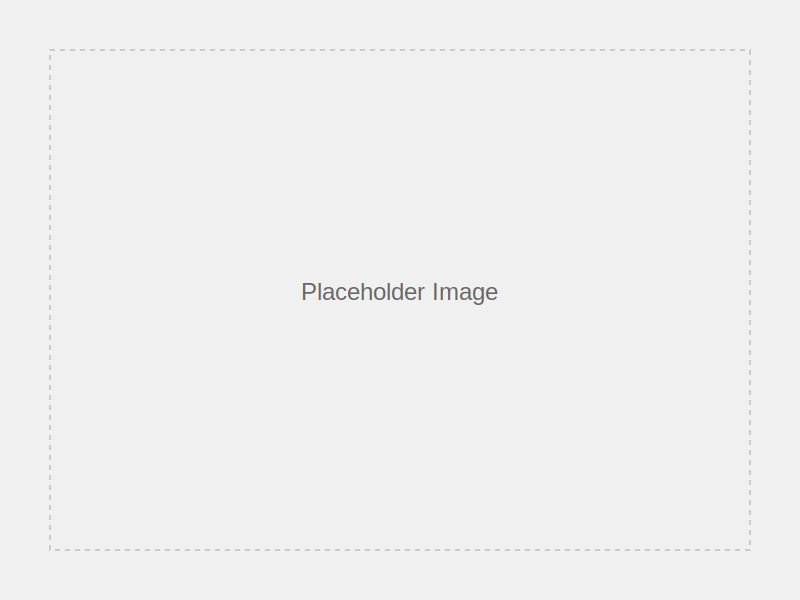

# エンジニアカフェへようこそ  
Welcome to Engineer Cafe

<!-- _class: lead -->

エンジニアが学び、交流し、成長できる公共スペース

<!--
スライド1のスピーカーノート：
エンジニアカフェへの導入スライドです。
無料で利用できる公共のコワーキングスペースであることを伝えます。
-->

---

## エンジニアカフェとは

- **2019年8月誕生**  
- **「エンジニアフレンドリーシティ福岡」の一環**  
- **コミュニティマネージャー常駐**  
- **ハッカーサポーターによる技術支援**
- **完全無料**の公共施設

<!--
スライド2のスピーカーノート：
エンジニアカフェの成り立ちと基本情報を説明します。
福岡市が運営する無料の公共施設であることを強調します。
-->

---

<!-- _class: service-detail -->

## コワーキングスペース

### 3つのエリアをご利用いただけます

| スペース | 特徴 |
|----------|------|
| **メインホール** | 開放的・イベント時以外は無料 |
| **Under スペース** | 地下、落ち着いた雰囲気 |
| **集中スペース** | 6席・完全静音 |

**注意:** 集中スペースは通話・Web会議禁止

<!--
スライド3のスピーカーノート：
利用できる3つのスペースについて説明します。
特に集中スペースでは静寂を保つ必要があることを強調します。
-->

---

## 利用時間と延長

### 営業時間: **9:00-22:00**

- **基本 2時間**（防音室は1時間）
- 空きがあれば**延長無制限**
- 申請方法  
  1. **スタッフへ直接**  
  2. **Discord 受付チャンネル**

<!--
スライド4のスピーカーノート：
営業時間は9時から22時までです。
基本は2時間利用で、空きがあれば延長可能であることを説明します。
-->

---

<!-- _backgroundColor: #f0f8ff -->

## 重要文化財でのマナー

### 赤煉瓦文化館は国の重要文化財

- **飲食不可**  
  - 蓋付き飲料のみ可  
  - **ストローは禁止**
- **歴史ある建物を大切に**

<!--
スライド5のスピーカーノート：
重要文化財での利用マナーについて説明します。
飲食制限があることを明確に伝える必要があります。
-->

---

## 会員登録手順

### 簡単3ステップ

1. **Wi-Fi 接続**  
   - SSID: **engnrcf-guest-5GHz**  
   - PASS: **akarenga-112years**
2. **QRコードでフォーム入力**  
3. **会員番号はスタッフと一緒に確認**

<!--
スライド6のスピーカーノート：
会員登録の手順を具体的に説明します。
Wi-Fi情報と登録プロセスを明確に案内します。
-->

---

<!-- _class: community -->

## 会員証について

### レーザー加工機で作成 ⇒ **再発行不可**

- **紛失時**  
  - 電話番号／名前で照会可  
  - 写真提示でも可  
- **NFC 連携**でスマホタップ入館可  
- **ストラップは 1 人 1 本**

<!--
スライド7のスピーカーノート：
会員証は再発行できないことを強調します。
紛失時の対応方法とNFC連携について説明します。
-->

---

## 次回以降の受付

<!-- _class: pricing -->

### 受付での手順

1. **利用スペース指定**  
2. **ネックホルダー受取** (Wi-Fi 情報付き)  
3. **15 分以上離席→一旦退席処理**  
4. **ネックホルダー返却**

**Discord 招待コードも裏面に記載**

<!--
スライド8のスピーカーノート：
次回来館時の受付手順を説明します。
ネックホルダーの取り扱いとDiscord情報について案内します。
-->

---

<!-- _backgroundColor: #fff5ee -->

## エンジニアカフェの想い

### ルールより「協力」  
### みんなで心地よい空間をつくる

- **最低限のルール**  
- **協力がなければ追加ルールが必要に**  
- **自由で快適な環境を一緒に守りましょう**

<!--
スライド9のスピーカーノート：
エンジニアカフェの運営哲学について説明します。
利用者同士の協力で快適な環境を維持していることを伝えます。
-->

---

<!-- _class: cta -->

# ご清聴ありがとうございました

### お問い合わせはスタッフまで

**営業時間**: 9:00-22:00  
**場所**: 福岡市 赤煉瓦文化館内  
**利用料**: 完全無料

<!--
スライド10のスピーカーノート：
プレゼンテーションの終了スライドです。
営業時間と無料であることを再度強調します。
-->

